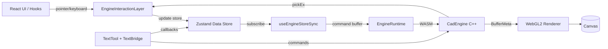

# AUDIT_REPORT.md

## Executive Summary
- Arquitetura real e React-first: `frontend/stores/useDataStore.ts` e `frontend/stores/useUIStore.ts` sao a fonte de verdade; o engine recebe comandos e renderiza, sem estado canonico persistente.
- O sistema esta hibrido: ha caminhos paralelos JS vs Engine para selecao/transform, e texto e gerenciado em dupla autoridade (JS + Engine), o que eleva risco de desync.
- Riscos imediatos: desalinhamento de IDs (IdRegistry vs idAllocator), comandos enviados sem suporte no C++ (SetEntityFlags), `queryArea` ausente, e O(N) por pointermove no sync.
- Para Engine-First, o projeto precisa primeiro endurecer o contrato TS-WASM e estabilizar hot paths, antes de mover a autoridade para o C++.

## AS-IS Architecture

### Repo Map

**Frontend (React + Zustand)**
- Stores (fonte de verdade): `frontend/stores/useDataStore.ts`, `frontend/stores/useUIStore.ts`, `frontend/stores/useSettingsStore.ts`, slices em `frontend/stores/slices/*`.
- Hooks de ferramentas/interacao: `frontend/features/editor/hooks/useSelectInteraction.ts`, `frontend/features/editor/hooks/useDraftHandler.ts`, `frontend/features/editor/hooks/useTextEditHandler.ts`, `frontend/features/editor/hooks/interaction/usePanZoom.ts`.
- Camada de input: `frontend/features/editor/components/EngineInteractionLayer.tsx`, `frontend/features/editor/hooks/useKeyboardShortcuts.ts`, `frontend/components/TextInputProxy.tsx`.
- Overlays: `frontend/features/editor/components/SelectionOverlay.tsx`, `frontend/features/editor/components/StrokeOverlay.tsx`, `frontend/components/TextCaretOverlay.tsx`.
- Tipos: `frontend/types/index.ts`, `frontend/types/text.ts`, `frontend/types/picking.ts`.

**Runtime / Bridge (TS <-> WASM)**
- Runtime e comandos: `frontend/engine/core/EngineRuntime.ts`, `frontend/engine/core/commandBuffer.ts`, `frontend/engine/core/useEngineStoreSync.ts`, `frontend/engine/core/IdRegistry.ts`.
- Bridge e carregamento WASM: `frontend/engine/bridge/getCadEngineFactory.ts`, `frontend/engine/bridge/textBridge.ts`.
- Sync texto: `frontend/engine/core/textEngineSync.ts`, `frontend/engine/tools/TextTool.ts`.

**Engine C++ / WASM**
- API e loop central: `cpp/engine/engine.h`, `cpp/engine.cpp`.
- Entity management: `cpp/engine/entity_manager.h`, `cpp/engine/entity_manager.cpp`.
- Picking: `cpp/engine/pick_system.h`, `cpp/engine/pick_system.cpp`.
- Texto: `cpp/engine/text_system.h`, `cpp/engine/text_system.cpp`, `cpp/engine/text/*`.
- Commands/Snapshot: `cpp/engine/commands.h`, `cpp/engine/commands.cpp`, `cpp/engine/snapshot.h`, `cpp/engine/snapshot.cpp`.
- Vector IR/Tessellation: `cpp/engine/vector_ir.h`, `cpp/engine/vector_tessellation.h`, `cpp/engine/vector_tessellation.cpp`.
- Bindings: `cpp/engine/bindings.cpp`.

**Renderer (WebGL2)**
- Controller e camada: `frontend/engine/core/CanvasController.ts`, `frontend/engine/renderer/TessellatedWasmLayer.tsx`.
- Passes: `frontend/engine/renderer/webgl2/passes/GeometryPass.ts`, `frontend/engine/renderer/webgl2/passes/TextRenderPass.ts`.
- Batching e shaders: `frontend/engine/renderer/webgl2/triBatching.ts`, `frontend/engine/renderer/webgl2/shaders/*`.

### AS-IS Flow Diagram

### Observed AS-IS Architecture
- O estado canonico vive em React/Zustand; o engine e sincronizado via `useEngineStoreSync` e recriado a partir do store em reset.
- Picking esta no C++ (`pickEx`), mas selecao, handles e validacoes de visibilidade/lock ainda ocorrem no JS.
- Texto e hibrido: o engine calcula layout e armazena conteudo, enquanto o React guarda o texto e bounds para UI.
- Existem pipelines paralelos para transformacao (JS e Engine), com guardas para evitar conflito (`isInteractionActive`).

## Engine-First Gap Analysis

### Source of Truth Table
| Dominio | Autoridade Atual | Onde Vive | Risco | Ideal (Engine-First) |
| --- | --- | --- | --- | --- |
| Shapes / Geometria | React | `frontend/stores/useDataStore.ts` | Duplicacao e desync com o engine | Engine armazena shapes e emite snapshots |
| Picking / Hit-test | Engine (parcial) | `cpp/engine/pick_system.*` + JS filtros | IDs e flags inconsistentes; JS filtra depois | Engine faz pick com flags e retorna resultado final |
| Handles / Vertex / Resize | JS | `frontend/features/editor/hooks/useSelectInteraction.ts` + overlays | Logica duplicada e divergente | Engine expor handles e regras de edicao |
| Move / Drag / Transform | JS + Engine | `useSelectInteraction.ts` + `EngineInteractionLayer.tsx` | Duas logicas concorrentes | Engine gerencia sessao de transform e deltas |
| Texto (conteudo vs layout) | Hibrido | `TextTool.ts` + `TextBridge.ts` + store | Possivel desync de conteudo/bounds | Engine e dono de conteudo e layout |
| Layers / Visibility / Lock | React | `useDataStore.ts` + `utils/visibility.ts` | Engine nao aplica flags/lock | Engine aplica visibilidade/lock na render/pick |
| Undo / Redo / History | React | `frontend/stores/slices/historySlice.ts` | Engine diverge do historico | Engine registra comandos e historico |
| Persistencia / Serializacao | React (com snapshot parcial) | `serializeProject()` + `getSnapshotBufferMeta()` | Snapshot nao cobre todos os tipos | Engine serializa o estado completo |

### Principais Gaps
- IDs de entidades: `frontend/engine/core/IdRegistry.ts` vs `frontend/engine/core/idAllocator.ts` (na pratica, apenas o primeiro e usado no sync; o segundo e usado em picking/transform).
- Comandos: `CommandOp.SetEntityFlags` e `SetEntityFlagsBatch` existem no TS, mas nao no C++ (`cpp/engine/types.h` / `cpp/engine.cpp`).
- `queryArea` e chamado pelo JS (`useSelectInteraction.ts`) mas nao existe no `CadEngine` nem em `bindings.cpp`.
- Tipos de shape nao suportados pelo engine (`arc`, `measure`, `text`, `svgSymbol`) nao sao renderizados/pickados no pipeline atual.
- Logica de visibilidade/lock ainda depende de JS, mas o pick do engine nao considera flags.

## Performance Audit

| Hot Path | Arquivo / Funcao | Complexidade | Impacto | Conflito com Engine-First |
| --- | --- | --- | --- | --- |
| Sync React -> Engine | `frontend/engine/core/useEngineStoreSync.ts` (`buildVisibleOrder`, `applySync`) | O(N log N) por update | FPS cai em drag/typing | Engine-First exige evitar O(N) em pointermove |
| Sync texto (scan IDs) | `frontend/engine/core/useEngineStoreSync.ts` (`getAllTextShapeIds`) | O(N_text) por update | Cresce com IDs acumulados | Engine-First deve evitar scan global |
| Stroke overlay | `frontend/features/editor/components/StrokeOverlay.tsx` | O(N) por render | Alto em docs grandes | Overlay deveria ser view leve do engine |
| Tessellated batches | `frontend/engine/renderer/webgl2/passes/GeometryPass.ts` (`computeTriangleBatches`) | O(V) por update | Alto durante drag | Precisa de estrategia incremental |
| Command buffer + alloc/free | `frontend/engine/core/EngineRuntime.ts` | O(C) por update | Alto em input continuo | Engine-First precisa de buffers reutilizaveis |
| Move/resize JS | `frontend/features/editor/hooks/useSelectInteraction.ts` | O(K*P) | Medio | Transformacao deveria ser do engine |
| Snapping global | `frontend/features/editor/snapEngine/index.ts` (se ativado) | O(N) por move | Alto | Deveria ser indexado no engine |

## Boundary Audit (TS <-> WASM)

### Achados
- **CommandOp desalinhado**: TS envia `SetEntityFlags`/`SetEntityFlagsBatch`, mas o C++ nao reconhece (gera `UnknownCommand`).
- **`queryArea` ausente**: JS espera `runtime.engine.queryArea`, mas `CadEngine` nao exporta.
- **Mapeamento de IDs duplo**: Ids do engine vem de `IdRegistry` (sequencial), mas picking/transform usam `idAllocator` (hash). O mapa nao e populado, gerando falhas de resolucao.
- **Contrato de texto divergente**: `textPayloadHeaderBytes` e `textRunRecordBytes` em `cpp/engine/types.h` nao refletem o tamanho real das structs (indicacao de drift).
- **Indices texto UTF-8**: JS usa indices logicos e converte para bytes; qualquer divergencia em conversao causa selecao/caret incorretos.

### Guardrails Conceituais (sem codigo)
- Testes de ABI para validar tamanhos e alinhamentos de payloads e enums.
- Versao de protocolo/feature negotiation para comandos opcionais.
- Um unico sistema de IDs e regra clara de reset/cleanup por documento.
- Assertiva de integridade no runtime (ex.: opcodes e tamanhos esperados).

## UX/Tooling Audit (arquitetural)
- **Dualidade de interacao**: selecao/drag/resizing existe em JS (`useSelectInteraction.ts`) e em sessoes do engine (`EngineInteractionLayer.tsx`), criando comportamentos diferentes e risco de desync.
- **Overlays como logica**: `SelectionOverlay.tsx` e `StrokeOverlay.tsx` recalculam geometria em JS; se a renderizacao do engine divergir, a UX fica inconsistente.
- **Texto hibrido**: hit-test e bounds em JS sao baseados em `Shape` no store, mas o engine tem layout real; isso pode gerar click/caret deslocado.
- **Locked/Visibility**: filtros existem no JS, mas o engine nao aplica flags; em fluxo engine-first a logica precisa ser unica.
- **Marquee selection**: depende de `queryArea` (inexistente), gerando selecao inconsistente.

## Risk Register

| ID | Risco | Impacto | Probabilidade | Mitigacao Arquitetural |
| --- | --- | --- | --- | --- |
| R1 | CommandOp TS != C++ (flags) | High | High | Alinhar contrato de comandos e feature flags |
| R2 | IDs duplos (IdRegistry vs idAllocator) | High | High | Unificar mapeamento e reset por documento |
| R3 | `queryArea` ausente | Med | High | Expor query no engine ou manter fallback JS |
| R4 | O(N) por pointermove no sync | High | High | Redesenhar sync incremental e visibilidade |
| R5 | StrokeOverlay O(N) | Med | High | Reduzir overlay a view do engine |
| R6 | Transformacao dual JS/Engine | High | Med | Consolidar em um unico pipeline |
| R7 | Texto com dupla autoridade | High | Med | Definir engine como dono do conteudo/layout |
| R8 | Flags de lock/visibility nao aplicadas no engine | Med | Med | Engine aplicar flags no pick/render |
| R9 | Shapes nao suportadas no engine | Med | Med | Decidir suporte ou limitar features |
| R10 | IdRegistry nao limpa IDs | Low/Med | Med | Politica de cleanup por documento |
| R11 | Logica de disciplina/eletrica no frontend | Med | Med | Remover dependencia de dominio especifico |

## Roadmap TO-BE (Engine-First)

### Fase 0 - Hardening e Performance
- **Objetivo**: estabilizar contrato TS-WASM, reduzir hot paths e eliminar falhas basicas.
- **Muda**: unificacao de IDs, comandos consistentes, `queryArea` funcional, metricas de sync/renderer.
- **Nao fazer ainda**: mover fonte de verdade para o engine ou remover stores.
- **Criterios de conclusao**: sem `UnknownCommand`, pick->shape sempre resolvido, marquee funciona, nenhum O(N) em pointermove.

### Fase 1 - Command Pattern e Snapshots
- **Objetivo**: React como dispatcher, engine como processador e produtor de snapshots.
- **Muda**: interacoes (move/resize/vertex) passam a enviar comandos e recebem deltas/snapshots.
- **Nao fazer ainda**: eliminar completamente Zustand (mantem cache de UI).
- **Criterios de conclusao**: selecao/transform/texto fluem somente por comandos do engine.

### Fase 2 - Inversao de Autoridade
- **Objetivo**: engine e a unica fonte de verdade do documento.
- **Muda**: shapes, layers, selecao, z-order, undo/redo e persistencia vivem no C++.
- **Nao fazer ainda**: features de dominio especifico; manter core generico.
- **Criterios de conclusao**: UI reflete snapshots do engine e nao mantem copias autoritativas.

## Next Actions (priorizadas)

- **P0**: Unificar o sistema de IDs e garantir reset/cleanup por documento (pick, transform, sync).
- **P0**: Alinhar `CommandOp` entre TS e C++ e remover comandos nao suportados.
- **P0**: Disponibilizar `queryArea` no engine ou garantir fallback confiavel no JS.
- **P0**: Reduzir O(N) no `useEngineStoreSync` (visibilidade e sorting por update).
- **P1**: Consolidar transformacao em um unico pipeline (JS ou Engine, nao ambos).
- **P1**: Definir contrato de texto engine-first (conteudo/layout, indices, snapshot).
- **P1**: Mover visibilidade/lock para o engine e aplicar no pick/render.
- **P2**: Planejar undo/redo e serializacao como responsabilidade do engine.
