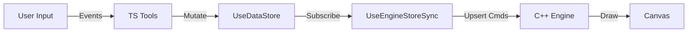

# AUDITORIA FINAL: ROADMAP PARA ENGINE-FIRST (C++ AUTHORITY)

## 1. Executive Summary

A auditoria confirma que o **EndeavourCanvas** opera em um estado híbrido avançado, mas ainda fundamentalmente **React-First**. Embora tenhamos "superpoderes" do C++ (Picking, Render, Sessões de Interação), a autoridade final dos dados e a persistência (Undo/Redo) residem inteiramente no Zustand (TS).

**Pontos Fortes (Excellent):**
*   **Engine Interaction Sessions:** O fluxo `beginTransform` -> `updateTransform` -> `commit` já existe e remove a carga do React durante o drag (`mousemove`). Isso é uma vitória crítica de performance.
*   **WebGL2 Renderer Sólido:** Pipeline de renderização eficiente com SSAA e Text Atlas, desacoplado do ciclo de renderização do React (`requestAnimationFrame` próprio).
*   **Picking Híbrido Funcional:** O uso de `pickEx` no C++ elimina a necessidade de `raycasting` complexo no JS para seleção básica.

**Bloqueadores para Engine-First Real (Critical):**
1.  **Dual Authority (Shadow State):** O estado existe duplicado. `useDataStore` é o mestre, e `CadEngine` é um espelho sincronizado via diffs custosos (`O(N)` em pior caso).
2.  **Lógica Geométrica Duplicada:** `useSelectInteraction.ts` ainda contém lógica complexa de `Resize`, `VertexDrag` e `Snap` em TypeScript, competindo ou ignorando a lógica do Engine.
3.  **Sync Unidirecional Reverso:** O fluxo atual é `React -> Sync -> Engine`. Para ser Engine-First, o fluxo deve ser `Input -> Engine -> Event/Snapshot -> React`.

**Recomendação Imediata:**
Priorizar a eliminação da lógica geométrica do TypeScript (`useSelectInteraction.ts`) e converter as ferramentas para enviarem **Comandos** ao Engine, em vez de mutarem o Store diretamente.

---

## 2. Arquitetura Atual (AS-IS)

### Fluxo de Dados e Autoridade
O sistema opera em um modelo **"Preview-Commit"**:
1.  **Estado Canônico:** `frontend/stores/useDataStore.ts` (React).
2.  **Espelho de Renderização:** `cpp/engine/entity_manager.h` (C++).
3.  **Sincronização:** `useEngineStoreSync.ts` observa mudanças no React e empurra `Upsert*` commands para o C++.

### Score Engine-First Compliance (0-5)
| Domínio | Score | Justificativa |
| :--- | :--- | :--- |
| **Shapes** | 1/5 | React é dono absoluto. Engine é apenas cache de render. |
| **Picking** | 4/5 | `pickEx` (C++) é a fonte primária. Fallback legado ainda existe. |
| **Manipulation** | 3/5 | Drag é Engine-driven (ótimo), mas Commit volta p/ React Store. |
| **Text** | 2/5 | Texto é gerido pelo `TextTool` (TS) com layout no Engine. Estado duplicado. |
| **Undo/Redo** | 0/5 | 100% no React (`historySlice`). Engine não sabe sobre histórico. |
| **Sync Model** | 2/5 | Baseado em Diff reativo em vez de Eventos/Comandos diretos. |

---

## 3. Performance Audit

### Hotspots Identificados

#### 1. Sincronização React -> Engine (Sync Loop)
*   **Evidência:** `frontend/engine/core/useEngineStoreSync.ts` -> `applySync`.
*   **Complexidade:** `O(N)` onde N = total de shapes (quando layers mudam).
*   **Problema:** O hook roda a cada mudança do store. Mudanças globais (ex: trocar visibilidade de layer) forçam uma passagem completa.
*   **Impacto:** Lags perceptíveis em arquivos grandes (>10k shapes).
*   **Correção recomendada:** Enviar comandos de alto nível (`SetLayerVisibility`) ao Engine e deixar o C++ iterar (O(1) JS side).

#### 2. Picking & Interaction Initialization
*   **Evidência:** `frontend/features/editor/components/EngineInteractionLayer.tsx` -> `handlePointerDown`.
*   **Complexidade:** `O(1)` amortizado, mas com alocações de JS Objects.
*   **Problema:** `pickEx` é rápido, mas a lógica subsequente de montar a sessão (`beginTransform`) re-mapeia IDs de String para Hash em JS.
*   **Correção recomendada:** Usar mapas de inteiros diretos ou evitar round-trip de IDs para JS se possível.

#### 3. Duplicidade de QuadTree
*   **Evidência:** `useDataStore.ts` mantém um `spatialIndex` (JS QuadTree) E o Engine mantém outro (`pickSystem.cpp`).
*   **Risco:** Dobro de consumo de memória e desync potencial.
*   **Correção recomendada:** Remover `spatialIndex` do JS e usar `engine.pick/query`.

---

## 4. Boundary Audit (TS ↔ WASM)

### Segurança e Contratos
*   **Enum Parity:** `PickSubTarget` e `TransformMode` estão sincronizados via `emscripten::enum_` em `bindings.cpp`.
*   **Memory Safety:** O padrão `allocBytes` + `HEAPU8` + `freeBytes` em `EngineRuntime.ts` é seguro sob operação normal, mas frágil a exceções assíncronas.
*   **Risco de Alignment:** Não há verificação automática de tamanho de structs (`PickResult`, `TextPayload`). Se o compilador C++ alterar o packing, o JS lerá lixo.
*   **Recomendação:** Criar um teste de "ABI Checksum" que retorna `sizeof(struct)` do C++ e compara com constantes esperadas no TS.

---

## 5. Renderer Audit (WebGL2)

### Avaliação de Passes
*   **Estrutura:** O renderizador utiliza `GeometryPass` e `TextRenderPass`. Isso é excelente para separar responsabilidades.
*   **Buffers:** O sistema permite updates parciais, mas a carga inicial ou rebuilds grandes transferem buffers inteiros. O uso de memória WASM diretamente (`HEAPF32`) como fonte para `gl.bufferData` evita cópias desnecessárias no JS heap (Zero-Copyish).
*   **Text Pipeline:** Utiliza Texture Atlas dinâmico. A chamada `rebuildTextQuadBuffer` no loop (`CanvasController.ts`) é um hotspot potencial se feita a cada frame sem verificação de dirty flag.
*   **Recomendação:** Adicionar check `if (!runtime.textQuadsDirty) return;` antes de reconstruir buffers de texto.

---

## 6. Tooling & UX Audit

### Consistência e Estado
*   **Modelos de Ferramenta:** As ferramentas (`useDraftHandler`, `TextTool`) são hooks React que gerenciam estado de "fantasma" (ghost) localmente ou via `DynamicOverlay`.
*   **Estado Transitório:** `EngineInteractionLayer` gerencia corretamente o estado "sessão" (`beginTransform`), isolando-o do Undo/Redo até o `mouseup`.
*   **Desync Risk:** Ferramentas como `useSelectInteraction` reimplementam lógica de "onde clicar para redimensionar" (resize handles) em JS, o que pode divergir da área de clique real do Engine, causando frustração (clicar no handle e nada acontecer).
*   **Undo/Redo:** Totalmente atômico no React, mas ignora estado interno do Engine (ex: seleção de texto, scroll).

---

## 7. Risk Register

| ID | Risco | Impacto | Probabilidade | Mitigação |
| :--- | :--- | :--- | :--- | :--- |
| **R-01** | **Desincronização de Estado (Shadow State)** | High | High | React e Engine discordarem sobre propriedades de um objeto (ex: locked), causando bugs visuais. | Migrar Authority para Engine (Fase 3). |
| **R-02** | **Performance do Sync O(N)** | High | Med | Arquivos grandes travando a UI ao mudar layers. | Otimizar Sync para usar `Command Buffers` diretos. |
| **R-03** | **Lógica de Resize Dividida** | Med | High | `useSelectInteraction` (TS) calcula bounding box diferente do Engine. | Portar lógica de resize math para C++ (`TransformMode::Resize`). |
| **R-04** | **Memory Leak no Marshaling** | Med | Low | Buffers não liberados no `EngineRuntime`. | Auditar `finally` blocks e usar arenas de memória. |

---

## 8. Roadmap: Transição para Engine-First Real (TO-BE)

### Fase 0: Hardening & Performance (Imediato)
*   **Objetivo:** Estancar sangria de performance e limpar débitos técnicos.
*   [ ] **Refatorar Sync:** Eliminar o loop `O(N)` na mudança de layers. Enviar comando `SetLayerVisibility` para o engine e deixar ele iterar internamente.
*   [ ] **Eliminar JS QuadTree:** Remover `spatialIndex` do `useDataStore` e usar exclusivamente `engine.pick/query`.
*   [ ] **Fix Text Rebuild:** Evitar chamadas desnecessárias a `rebuildTextQuadBuffer` no loop de render.

### Fase 1: Command Pattern (Intermediário)
*   **Objetivo:** Ferramentas param de tocar no Store diretamente.
*   [ ] **Criar `CommandDispatcher`:** Ferramentas enviam intents: `Dispatch('MOVE_SHAPE', { dx, dy })`.
*   [ ] **Optimistic Updates:** O Dispatcher atualiza o Engine *imediatamente* e agenda a atualização do React.
*   [ ] **Portar Lógica de Ferramentas:** Mover matemática de `Resize` e `Snapping` para C++.

### Fase 2: Inversão de Autoridade (O Grande Salto)
*   **Objetivo:** Engine se torna Source of Truth.
*   [ ] **Store como Cache:** `useDataStore` deixa de ser persistente e vira um "View Model".
*   [ ] **Persistência C++:** Implementar `Serialize/Deserialize` completo do documento no C++.
*   [ ] **Undo/Redo Nativo:** C++ gerencia a stack de histórico (snapshots delta).

---

## 9. Next Actions (Priorizadas)

**P0 (Crítico - Fazer Agora):**
1.  **Refatorar `useSelectInteraction.ts`:** Remover o cálculo manual de resize/drag em JS. Confiar 100% no `runtime.beginTransform` e `runtime.updateTransform`.
2.  **Fix Legacy Picking Fallback:** Garantir que `pickEx` nunca retorne `subTarget: None` se houver colisão válida.

**P1 (Próximo Ciclo):**
1.  **Remover JS QuadTree:** Substituir chamadas a `spatialIndex.query` por API `engine.queryArea(rect)`.
2.  **Otimizar Render Loop:** Adicionar dirty check no `CanvasController` para texto.

**P2 (Futuro):**
1.  **Native Text Editor:** Mover o estado de edição de texto para dentro do Engine.
